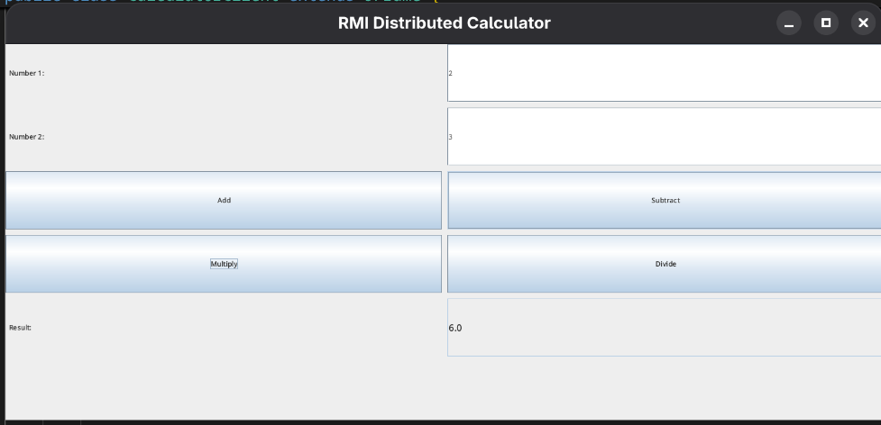

# Java RMI Distributed Calculator

This project is a **distributed calculator** implemented using **Java Remote Method Invocation (RMI)**, with a **Swing GUI** on the client side.

It directly implements the concepts from **Chapter 5: Distributed Programming**  
(_Advanced Programming – CSE 3312_) covered in the course PDF notes.

The calculator demonstrates **true distributed computing**:

- The **server** performs all calculations remotely
- The **client** provides a graphical user interface (GUI) for user interaction

---

## 📌 Key Concepts Implemented

- Java RMI fundamentals and architecture
- Remote interfaces
- Automatic stub/skeleton handling (modern Java)
- Object registry (created programmatically)
- Parameter and result serialization
- Client–server communication with hidden socket details
- Complete RMI application development workflow

---

## 🖥️ Application Screenshot

_The GUI allows users to enter two numbers and perform remote arithmetic operations.  
Results are returned instantly from the server._

---

## 📘 Relation to Chapter 5 (Distributed Programming)

| Chapter Concept             | Implementation in Project                       |
| --------------------------- | ----------------------------------------------- |
| RMI Architecture            | Used for all client–server communication        |
| Remote Interface            | `Calculator.java` extends `Remote`              |
| Server Implementation       | `CalculatorImpl` extends `UnicastRemoteObject`  |
| RMI Registry                | Created using `LocateRegistry.createRegistry()` |
| Binding & Lookup            | `Naming.rebind()` and `Naming.lookup()`         |
| Serialization               | Automatic for `double` parameters and results   |
| Hidden Socket Communication | Managed internally by Java RMI runtime          |
| Modern Java Usage           | No `rmic`, no deprecated security manager       |
